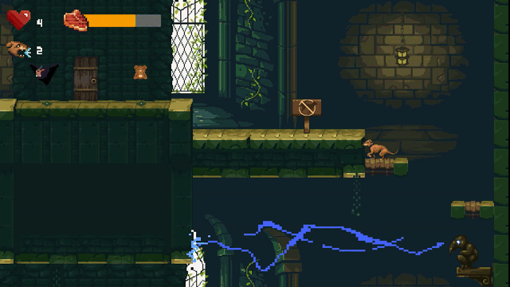
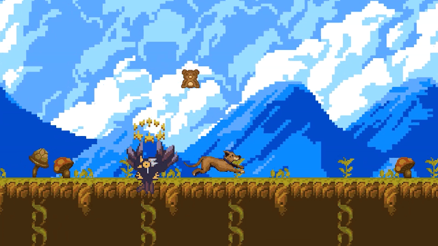
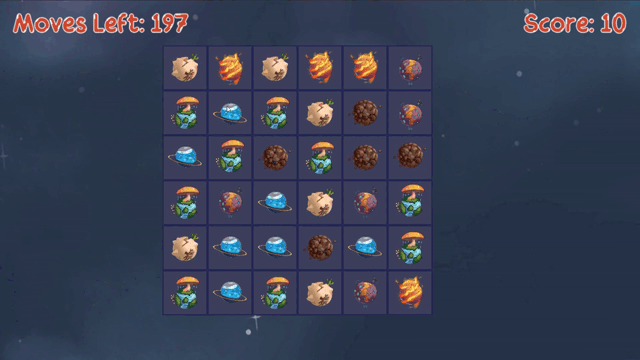
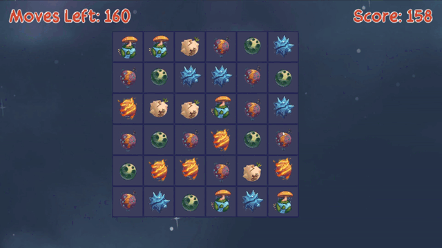
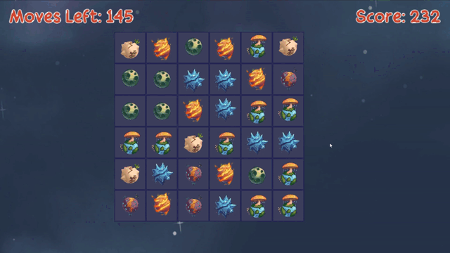
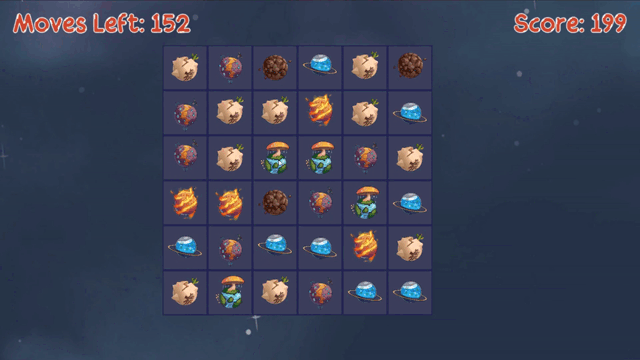

<h1>Hi, I'm Kobi!</h1>
<b>I am an Android and Unity Developer.</b>
  
I received my B.Sc degree in Computer Science from Bar-Ilan University in 2014. Since then, I have accumulated approximately 9 years of experience in software development, working in the industry at startups and a large company, and also independently as a solo developer.
 
 
I'm self-motivated, eager to learn, enjoy confronting technical challenges, and am accustomed to working both independently and as part of a development team.

---

<h1>Android Projects</h1>

<h2>🚗🚦🛑 | Driving Theory</h2>
<h3>Overview: </h3>

Driving Theory is an Android application designed to help users pass the official Israeli driving theory test. With a pool of thousands of official questions and answers, it allows users to practice various categories, simulate exams with time limits, review traffic signs, bookmark specific items, and track their progress. 
 
 The app supports both Hebrew and Arabic.

<h3>Technology (Android SDK):</h3>
Kotlin, MVVM, Android Jetpack Libraries (Compose, Navigation, Room, and more), Hilt, Coil.
 

<h3>Demo:</h3>
<!--

  
  
  

-->
<!--

  
  
  

-->

<h3>Available On:</h3>
(Coming soon, by the end of July 2024)
 

---

<h1>Unity Projects</h1>

<h2>🐕 | Freddy</h2>
<h3>Overview: </h3>
Freddy is a 2D platformer, starring a Dog as a protagonist. Inspired by early 90's PC classics like Commander Keen, Lion King and Prince of Persia.
 

 
This is a full, complete game, released on multiple platforms.
 

<h3>Technology (Unity):</h3>
C#, Unity Physics, Async/Await, Tilemap, Animator, State Machine & more.
 

<h3>Demo:</h3>

<!--
-->

  <picture>
    <source srcset="images/Freddy/F1.gif" height="49%" width="49%"  type="image/gif">
    
  </picture>
  <picture>
    <source srcset="images/Freddy/F2.gif"height="49%" width="49%"   type="image/gif">
    
  </picture>

  
  

 
<h3>Trailer:</h3>

 
<h3>Available On:</h3>

 
 

 

---

<h2>🪐 | Planet Crush</h2>

<h3>Overview: </h3>
PlanetCrush is a prototype for a match-3 game. 
 Although quite simple, it presented interesting challenges in terms of asynchronicity and a seamless user experience.

<h3>Technology (Unity):</h3>
C#, UniTask, DoTween, New Input System.

<h3>Demo:</h3>

  <picture>
    <source srcset="images/PlanetCrush/pc1.gif" height="49%" width="49%"  type="image/gif">
    
  </picture>
  <picture>
    <source srcset="images/PlanetCrush/pc2.gif"height="49%" width="49%"   type="image/gif">
    
  </picture>

  
  

  <!--
  <picture>
    <source srcset="images/pc4.gif" height="49%" width="49%"  type="image/gif">
    
  </picture>
  -->
<!--
  <picture>
    <source srcset="images/pc5.gif"height="49%" width="49%"   type="image/gif">
    
  </picture>
-->

  
<!--

  
  

  
  

-->
<h3>Project Repo:</h3>
<a href="https://github.com/kobersky/PlanetCrushWip/">Planet Crush</a>

