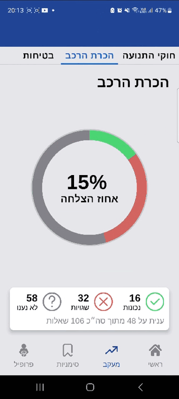

<h1>Hi, I'm Kobi</h1>
<b>I am an Android Developer with a background in Unity.</b>
  
With 10+ years in software development - I've worked across startups, a large-scale enterprise, and as an independent solo developer.
 
I'm comfortable working through technical challenges, digging into complex systems, and finding solutions that are efficient and maintainable.
<h1>Android Projects</h1>

<h2>🚗🚦🛑 | Driving Theory</h2>
<h3>Overview: </h3>

Driving Theory is an Android application designed to help users pass the official Israeli Driving Theory Test. With a pool of thousands of official questions and answers, it allows users to practice various categories, simulate exams with time limits, review traffic signs, bookmark specific items, and track their overall progress. 
 
 The app supports both Hebrew and Arabic.

<h3>Technology (Android SDK):</h3>
Kotlin, MVVM, Android Jetpack Libraries (Compose, Navigation, Room, and more), Hilt, Coil.
 

<h3>Demo:</h3>
<!--

  
  
  

-->
<!--

  
  
  

-->

  <picture>
    <source srcset="images/Driving/dtcategories.gif" height="25%" width="25%"  type="image/gif">
    
  </picture>
  <picture>
    <source srcset="images/Driving/dtpractice.gif" height="25%" width="25%"  type="image/gif">
    
  </picture>
  <picture>
    <source srcset="images/Driving/dtbookmarks.gif" height="25%" width="25%"  type="image/gif">
    
  </picture>

  <picture>
    <source srcset="images/Driving/dtprogress.gif" height="25%" width="25%"  type="image/gif">
    
  </picture>
    <picture>
    <source srcset="images/Driving/dtbookmarks.gif" height="25%" width="25%"  type="image/gif">
    
  </picture>
    <picture>
    <source srcset="images/Driving/dtsigns.gif" height="25%" width="25%"  type="image/gif">
    
  </picture>

<h3>Available On:</h3>

 

---

<h1>Unity Projects</h1>

<h2>🐕 | Freddy</h2>
<h3>Overview: </h3>
Freddy is a complete 2D platforming game which I created.
 
 
Starring a Dog as a protagonist and being inspired by early 90's PC classics like Commander Keen, it features puzzle-platforming mechanics, varied level layouts, and a mix of action and exploration.
 

<h3>Technology (Unity):</h3>
C#, Unity Physics, Async/Await, Tilemap, Animator, State Machine & more.
 

<h3>Demo (gifs may take a few seconds to load):</h3>

<!--
-->

  <picture>
    <source srcset="images/Freddy/F1.gif" height="49%" width="49%"  type="image/gif">
    
  </picture>
  <picture>
    <source srcset="images/Freddy/F2.gif"height="49%" width="49%"   type="image/gif">
    
  </picture>

  <picture>
    <source srcset="images/Freddy/F3.gif" height="49%" width="49%"  type="image/gif">
    
  </picture>
  <picture>
    <source srcset="images/Freddy/F4.gif"height="49%" width="49%"   type="image/gif">
    
  </picture>

 
<h3>Trailer:</h3>

 
<h3>Available On:</h3>

 
 

 

---

<h2>🪐 | Planet Crush</h2>

<h3>Overview: </h3>
PlanetCrush is a prototype for a match-3 game. 
 Although quite simple, it presented interesting challenges in terms of asynchronicity and a seamless user experience.

<h3>Technology (Unity):</h3>
C#, UniTask, DoTween, New Input System.

<h3>Demo:</h3>

  <picture>
    <source srcset="images/PlanetCrush/pc1.gif" height="49%" width="49%"  type="image/gif">
    
  </picture>
  <picture>
    <source srcset="images/PlanetCrush/pc2.gif"height="49%" width="49%"   type="image/gif">
    
  </picture>

  <picture>
    <source srcset="images/PlanetCrush/pc4.gif" height="49%" width="49%"  type="image/gif">
    
  </picture>
  <picture>
    <source srcset="images/PlanetCrush/pc5.gif"height="49%" width="49%"   type="image/gif">
    
  </picture>

<h3>Project Repo:</h3>
<a href="https://github.com/kobersky/PlanetCrushWip/">Planet Crush</a>

